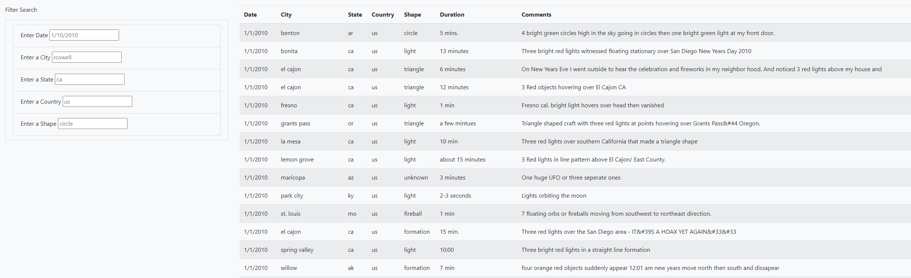
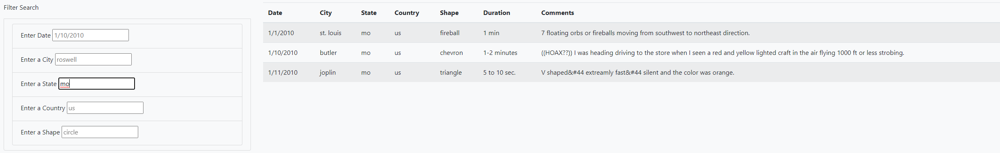

# UFOs

## Project Overview

This project focuses on building a dynamic webpage that accepts user inputs and adjusts accordingly to display information about UFO sightings.
In order to perform their analysis, users will be able to filter the UFO sightings table based on multiple criteria such as the event date, city, state, country and shape.

The web-page contains:

    - Interactive filters for searching criteria on date, city, country and shape.
    - A header with a refresh-page button.
    - Brief article and its summary.

### Resources

    = data.js
    = app.js
    = index.html
    - styles.css
    - BootStrap 4

## Results

By displaying the raw data.js file as a table, and with the filer input box, the user can dynamically search though the elements of the array based on date, city, state, country and shape of UFOs sighting.

When user types desired criteria in multi-filter and then press enter the table displays only rows that matches the user input. From the picture below we can see only data that has been filtered based on the user input – that is -- State: ca, Shape: light and Date: 1/1/2010.

Here, there user has filtered based on the state MO:

There are two options to clear filter results.
The user can either can clear input manually deleting input cell by cell or click the refresh button UFO Sightings that can be found at the top left corner of the page. After the filter is cleared, the user can use filter again.

## Summary

This page takes a working understanding of several computer languages and the BootStrap library.  The result is a clean, easy way to parse through this large json file about UFO sightings.
This code could be refactored to look at other paramaters for a different json file with a little time and understanding of the new paramaters.

## Downside

- All the data is displayed at once which makes the entire web-page quite lengthy.

## Possible Improvements

- Add a dropdown list for some of the paramaters to make searches more streamlined for the users. For example, add a list of all the states and cites with UFO sightings.

- The reset button is too far away from the filter which is inconvenient, especially on smaller screens, when user has to scroll up to reach the reset button and clear out the filter.